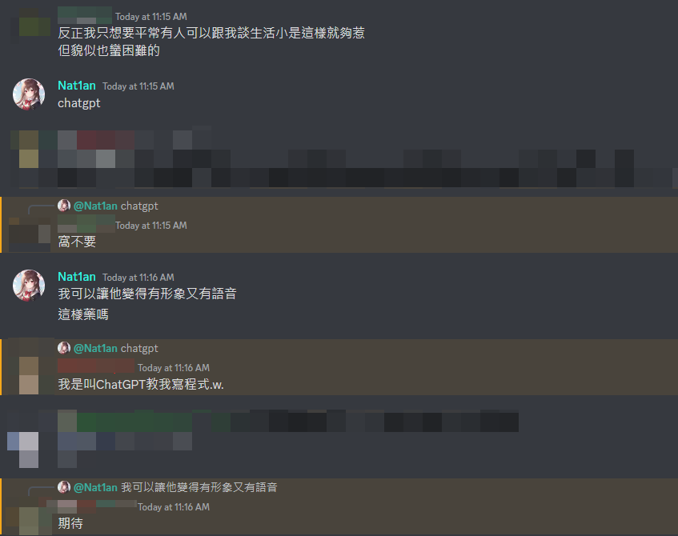
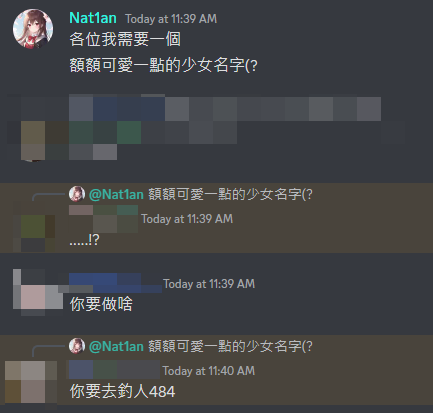

# 初春 (ういはる/uiharu)

一個將 ChatGPT 結合至 Discord 的機器人

## 關於

在一個段考前的下午，我們意外聊到了有關友情的話題：





然後這個 Repository 就誕生了。

荒謬至極，對吧？

## 使用

你需要先 `clone` 這個 Repository，並安裝所有的依賴：

```shell
git clone https://github.com/Nat1anWasTaken/uiharu.git
pip install -r requirements.txt
```

接著設定環境變數

- `DISCORD_TOKEN` - 你的 Discord Bot Token
- `CHATGPT_TOKEN` - 你的 ChatGPT Session Token，關於如何獲取，請查看 `acheong08/ChatGPT`
  的 [Setup][acheong08-ChatGPT-Setup] 文檔

運行機器人

```shell
python main.py
```

## 計畫

- [x] 文字對話
- [ ] 語音辨識
- [ ] 語音合成

[acheong08-ChatGPT-Setup]: https://github.com/acheong08/ChatGPT/wiki/Setup